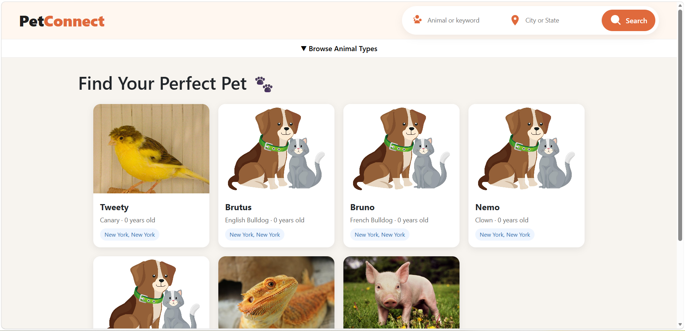
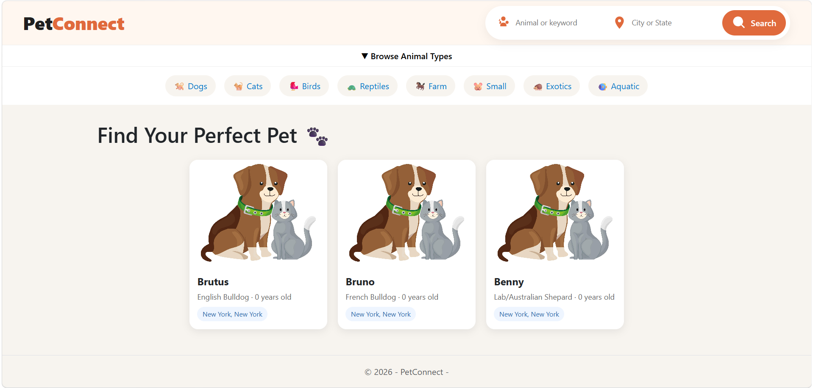

# PetConnect Frontend (Razor Pages)

PetConnect Frontend is an ASP.NET Core Razor Pages application that consumes a separate ASP.NET Core Web API to display adoptable animals by location and animal type. This application is currently deployed on Azure along with the backend and database. 

This project demonstrates how a frontend application can consume a REST API, filter data dynamically, and render a responsive UI for end users.

To view staff portal github, please visit here : [Pet Connect Staff Portal Github]((https://github.com/TanyaDThomas/PetConnect.git)

---

# Live Demos
The application is hosted on Azure's **Free tier**, which includes:
- Automatic idle timeout after ~20 minutes of inactivity
- Database auto-pause after ~1 hour

**To see a live demo:** Please reach out to me and I'll wake the site up for you. Once active, everything runs smoothly.

**[View Demo Site](
https://petconnectfrontend-b8dyfah2bef7fpcp.centralus-01.azurewebsites.net)**

**[Staff Portal](
https://petconnectclientportal-cdapepedgdbwd0ad.centralus-01.azurewebsites.net)**
> Demo credentials available upon request

---

## Backend API

This project connects to a separate backend repository:

- ASP.NET Core Web API (Pet Adoption System)
- Provides animal data via REST endpoints
- Supports filtering by:
  - City
  - State
  - Animal Type

> The frontend communicates with the backend using HttpClient.

---

## Features

- View all adoptable animals from API
- Search animals by:
  - City
  - State
  - Animal type (Dog, Cat, Bird, etc.)
- Responsive card-based UI
- Clean Razor Pages architecture
- Dynamic image loading (with fallback placeholder)
- Navigation search bar available across all pages

---

## How It Works

1. User enters search criteria (city/state/type)
2. Razor Page sends query to backend API
3. API returns filtered animal data
4. Frontend renders results dynamically

---

## API Integration

The frontend uses an `AnimalApiClient` service to communicate with the backend.

Example filter options:

- city
- state
- animalTypeId
---

## Technologies Used

- ASP.NET Core Razor Pages
- C#
- HttpClient
- REST API
- HTML / CSS
- Bootstrap
- JavaScript (light usage)
- Git & GitHub

---

## Purpose of Project

This project was built to demonstrate:

- Consuming a REST API from a frontend application
- Full-stack separation (frontend vs backend API)
- Filtering and displaying dynamic data
- Clean UI layout for data-driven applications

It is intended as a portfolio project for junior software engineering roles.

---

## Screenshots

## Video Demo

- ### Search By City Results

- ### Search By Animal Type Results

- ### Details Page

---

## Future Improvements

- Add pagination for results
- Improve search filtering (breed, age, etc.)
- Add loading indicators
- Improve mobile UX

---

## Author

Built by Tanya Thomas

[GitHub:](https://github.com/TanyaDThomas)

